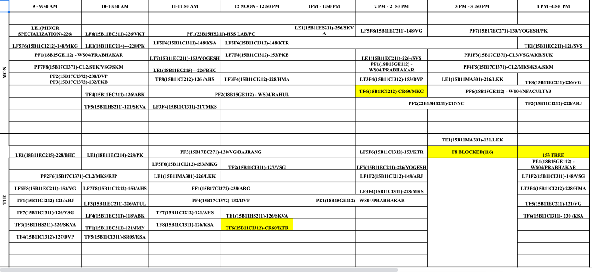
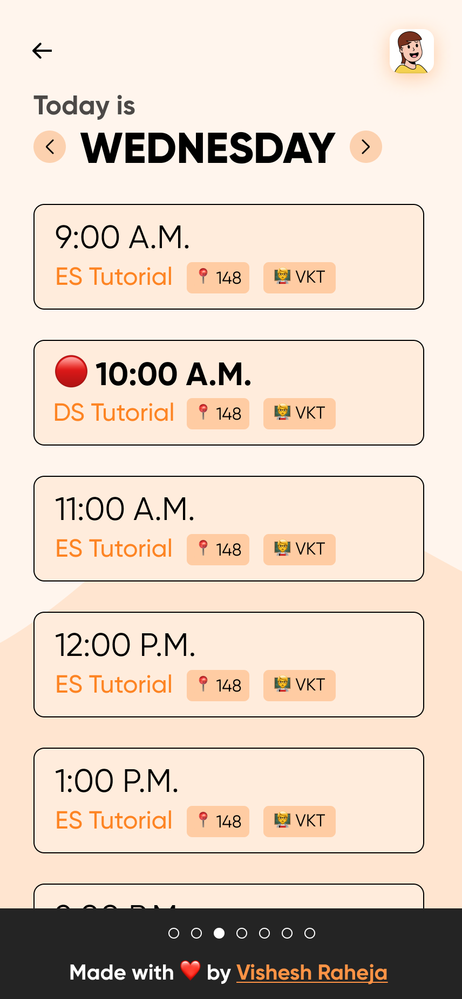

# jiit-timetable-frontend

This is the frontend for the JIIT Timetable app. It is built using Jetpack Compose.

## Why this project?
Our college looks like this:
<!-- img width= "300"> -->

It is not user friendly and is not mobile friendly. So, I decided to make a timetable app for our college.

First, the data is extracted from the timetable Excel using a parser I created in python [jiit-timetable-parser](https://github.com/entropyconquers/jiit-timetable-parser).
Then, the data is sent to the backend using a REST API. The backend is built using NodeJS and Database is MongoDB Atlas. [jiit-timetable-backend](https://github.com/entropyconquers/jiit-timetable-backend)
The backend is hosted on Vercel.

The frontend is built using Jetpack Compose. 

## Screenshots
<!-- show images in a table -->

| | | |
|:-------------------------:|:-------------------------:|:-------------------------:|
||||

## Features
- [x] View timetable
- [x] View timetable for a specific day
- [x] View timetable for a specific batch and year

## Upcoming Features
- [ ] Add timetable
- [ ] Edit timetable
- [ ] Delete timetable
- [ ] Add/Edit timetable for a specific day
- [ ] Add/Edit timetable for a specific batch and year
- [ ] Add/Edit timetable for a specific time slot

## About
This app is built using Jetpack Compose. It is a single activity app with multiple composable screens. It uses the the [Retrofit](https://square.github.io/retrofit/) library for making network requests.

